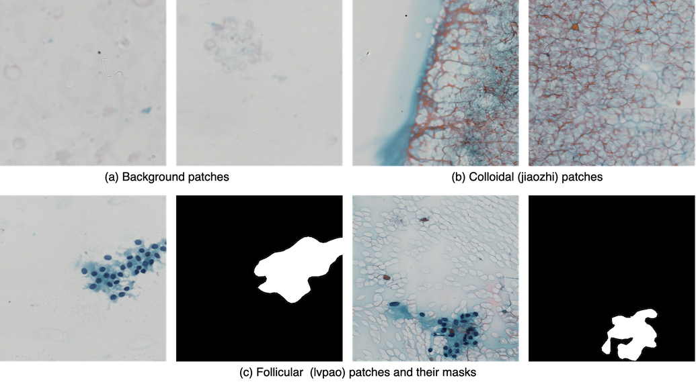

# Hybrid-Model-Enabling-Highly-Efficient-Follicular-Segmentation
## Introduction

### Abstract
The prevalence of thyroid cancer is growing rapidly.  Early and precise diagnosis is critical in thyroid cancer caring.  An automatic thyroid cancer diagnostic tool can be valuable to achieve early detection and diagnostic consistency.  Only the follicular areas in the sample contain useful information to the thyroid cancer diagnosis based on fine needle aspiration (FNA). This study aimed to develop a highly efficient accurate method for follicular cell areas segmentation (FCAS) of thyroid cytopathological whole slide images (WSIs).

A total of 96 cell samples from July 2017 to July 2018 in one hospital in Beijing, China were collected.  Forty-three WSIs were selected and manually labeled, including 17 cases of papillary thyroid carcinoma sample and 26 cases of benign sample.  6900 cropped typical image patches (available on our github) of 1024×1024 pixels from 13 large WSIs were used for patch-level model training and testing and all of the 13 large WSIs were papillary thyroid carcinoma samples.  Thirty testing WSIs with an average size 36,217×29,400 (from 10,240×10,240 to 81,920×61,440) were used to test the effectiveness of the hybrid model.  Based on the traditional semantic segmentation model deeplabv3, we constructed a hybrid segmentation architecture by adding a classification branch into the segmentation scheme to improve efficiency.  Accuracy was used to measure the performance of the classification model; pixel accuracy (pAcc), mean accuracy (mAcc), mean intersection over union (mIoU), and frequency weighted intersection over union (fwIoU) were used to measure the performance of the segmentation model, respectively.

### Problem
[comment]:<>


1. Large size: the thyroid cytopathological WSIs, which are generated through an electronic scanner of the thin tumor sample, often are in a very large size (for example, 19,6608×94,208). The typical size of a single slide is tens of gigabytes, thus it exceeds GPUs memory limitations.

2. The effective data area is small and sparsely distributed： each thyroid WSI slide often contains follicular areas, colloid areas, and the other blank background areas. Only the follicular areas as denoted by the blue points in the above figure, which often occupy less than 2% area in a thyroid WSI, contain useful information to the thyroid cancer diagnosing.


### Architecture Overview


1. Most of the colloid areas and background areas are recognized and discarded by the classification branch;
2. The patches that contain follicular are further processed by the segmentation branch.

### Highlights
1. Fast segmentation of follicular areas;
2. Hybrid architecture by integrating classification branch and segmeatation branch.

## Citation
Please cite this paper in your publications if it helps your research: [pdf of Intelligent Medicine](https://www.sciencedirect.com/science/article/pii/S2667102621000036)
```
@article{zhu2021hybrid,
  title={Hybrid model enabling highly efficient follicular segmentation in thyroid cytopathological whole slide image},
  author={Zhu, Chuang and Tao, Siyan and Chen, Huang and Li, Minzhen and Wang, Ying and Liu, Jun and Jin, Mulan},
  journal={Intelligent Medicine},
  year={2021},
  publisher={Elsevier}
}
```


Workshop version: [pdf of AAAI_Workshop](https://arxiv.org/abs/1902.05431)
```
@inproceedings{tao2019highly,
  title={Highly efficient follicular segmentation in thyroid cytopathological whole slide image},
  author={Tao, Siyan and Guo, Yao and Zhu, Chuang and Chen, Huang and Zhang, Yue and Yang, Jie and Liu, Jun},
  booktitle={International Workshop on Health Intelligence},
  pages={149--157},
  year={2019},
  organization={Springer}
}
```
## Dataset


You can download the patch dataset (about 10G) through address: [baiduwangpan](https://pan.baidu.com/s/1JcOXFklZKLOcHEexvtFLjQ)  

To obtain the password pls email me: czhu@bupt.edu.cn 

Or 

Download the dataset through: [Google-Cloud-Storage](https://drive.google.com/file/d/1t1W7tpKscqLxPApqH3JSP_zsljLHWKxQ/view?usp=sharing)

Note:
- The "patch dataset" is desensitized and can only be used for research；
- Classification model training: "background"、"jiaozhi"、"lvpao";
- Segmentation model training: "lvpao"; (of course, "background" and "jiaozhi" can also be added into training, and they are treated as "non-follicular" areas)
- Models can be trained in several stages or the whole hybrid model can be trained in an end-to-end manner;
- Some very tiny follicular areas in "lvpao" are not labelled;
- You may only select part of the data to use according to actual needs;
- You can use python or matlab opening the "label" file to see the follicular annotations, or use the "label_transfered" file directly.

## Results and applications


1. Performing our algorithm first, then the doctors just check the obtained follicular regions. Through just checking these areas while skipping most of the irrelevant part, the doctors can  make diagnose quickly, and thus the diagnosis time is reduced. We called this scenario the semi-automatic diagnosis mode consists of two phases: automatic follicular region extraction and manual follicular checking;
2. Performing our algorithm first, then conduct automatic thyroid malignancy prediction based on the obtained follicular regions by using weakly supervised method, such as multiple instance learning. In this scenario, our work is still useful because many irrelevant areas are discarded prior to the thyroid malignancy prediction, and thus the diagnosing performance is boosted.

## Authors
Siyan Tao, Minzhen Li, Chuang Zhu:
- email: tao_siyan@163.com；1421887087@qq.com；czhu@bupt.edu.cn
- wechat: lmz__120189

If you have any questions, you can contact us directly.
